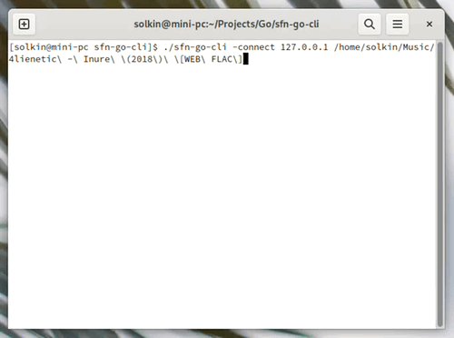

# sfn
Small and simple utility to send files over network.

CLI implementation of sfn L1 in Go language.



Build instructions
------------------

Requirements:

* Go 1.11+

Assuming you have it, type:

```
go build
```

This will produce `sfn-go-cli` executable in the project folder.

Build instructions
------------------

For usage instructions type:

```
./sfn-go-cli -help
```
